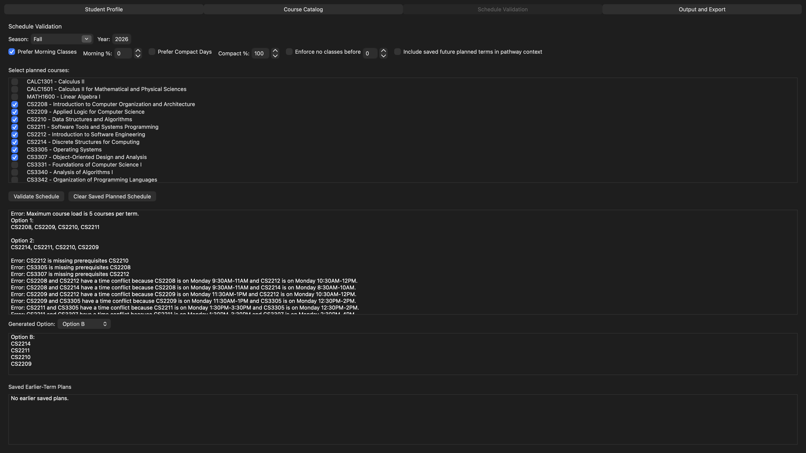
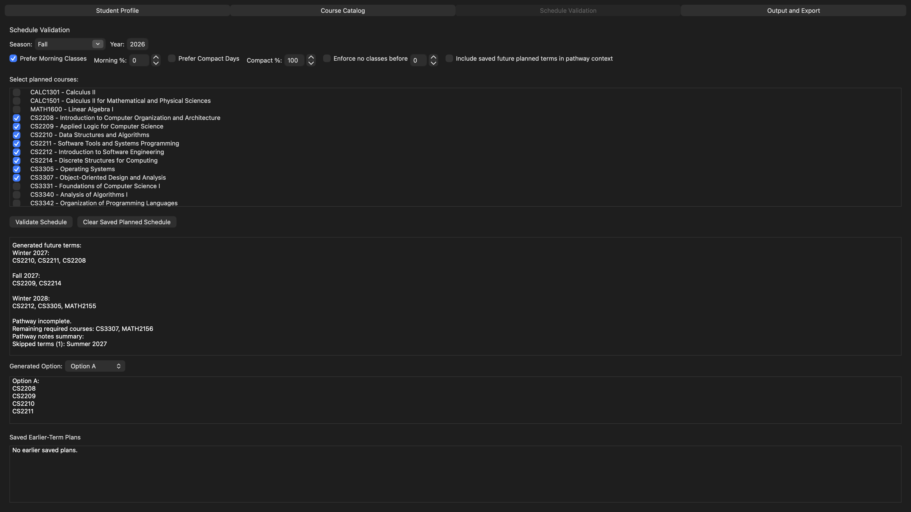
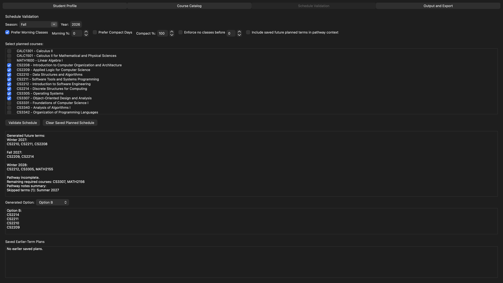

# CS GradWise Engine

CS GradWise is a C++ academic planning tool that uses constraint-based schedule generation, prerequisite validation, and multi-term pathway planning to help students build realistic course schedules toward graduation.

## Why This Project Matters

This project models academic planning as a rule-based decision engine. Given a student profile, course catalog, term, and planning preferences, the engine validates course selections, rejects invalid schedules, generates alternate valid options, and builds a best-effort multi-term pathway.

## My Contributions

- Built the core schedule generation engine in C++.
- Enforced hard constraints including prerequisites, course offerings, exclusions, time conflicts, and maximum course load.
- Added multiple schedule generation options using deterministic ordering strategies and deduplication.
- Implemented preference-based ranking for morning classes and compact schedules.
- Built multi-term pathway generation with prerequisite-aware sequencing, required-course progression, level gating, and no-progress term handling.

## Screenshots

### Constraint-Based Schedule Validation



### Multiple Schedule Options



### Multi-Term Pathway Generation



## Core Features

- Constraint-based schedule validation
- Prerequisite checking
- Time conflict detection
- Course offering validation by term
- Maximum course load enforcement
- Multiple valid schedule generation
- Preference weighting for morning and compact schedules
- Hard preference filtering such as no classes before a selected time
- Multi-term required-course pathway generation
- Persistent planned schedule context

## Technical Highlights

- C++ object-oriented design
- wxWidgets desktop interface
- Course catalog modeling with prerequisites, exclusions, offerings, terms, and timeslots
- Hash-based course lookup through `CourseCatalog`
- Rule-style prerequisite evaluation using `SIMPLE`, `ONE_OF`, and `CREDITS_FROM` prerequisite types
- Deterministic heuristic schedule generation
- Canonical deduplication of generated schedule options
- Rolling satisfied-course context for multi-term planning

## Algorithmic Approach

The schedule engine uses a deterministic greedy constraint-satisfaction approach. It scans candidate courses in priority order and only accepts a course if it passes all hard validation rules. To generate multiple options, the engine applies different candidate orderings, filters invalid results, removes duplicates using canonical course-set keys, and ranks schedules using soft preference scores.

The multi-term pathway generator carries forward a set of satisfied courses across terms, repeatedly generates valid term plans, updates prerequisite context, and advances through academic terms until required specialization courses are satisfied or the term limit is reached.

## Banking / Risk Engine Connection

Although the domain is academic planning, the architecture mirrors a compliance or risk decisioning engine. Each proposed course behaves like an application or transaction, and each academic rule acts like a policy control. The engine evaluates eligibility, rejects invalid combinations, records exceptions, and returns valid ranked options under hard and soft constraints.

## Build Requirements

- CMake
- wxWidgets
- C++17-compatible compiler

## Build and Run

```bash
cmake -S . -B build
```

```bash
cmake --build build
```

```bash
./build/group04
```

On Windows, the executable may be located under:

```bash
./build/Debug/group04.exe
```

## Data Format

The course catalog is loaded from `data/courses.txt`.

Each course is stored in a block that starts with `COURSE` and ends with `END`.

Supported fields:

- `CODE`
- `TITLE`
- `CREDITS`
- `BREADTH`
- `ELECTIVE`
- `PREREQUISITES`
- `PREREQ_ONE_OF`
- `PREREQ_CREDITS_FROM`
- `EXCLUSIONS`
- `OFFERING`
- `TIMESLOT`

## Key Files

- `src/ScheduleGenerationEngine.cpp`
- `src/ScheduleGenerationEngine.h`
- `src/ScheduleValidationPanel.cpp`
- `src/SchedulePreferences.h`
- `src/Prerequisite.cpp`
- `src/CourseCatalog.h`
